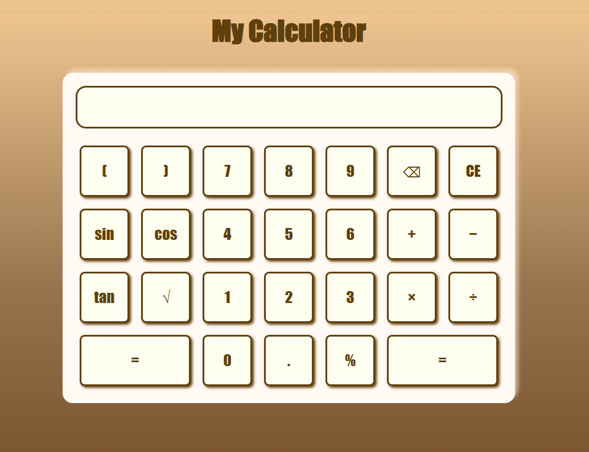

# My Calculator

A web calculator built with HTML, CSS and JavaScript.

## Features

- Basic operations: addition, subtraction, multiplication, division
- Scientific functions: sin, cos, tan, square root
- Parentheses
- Delete buttons (⌫ to erase one character, CE to clear everything)

## Usage

Download the project and open `index.html` in your browser.

## Technologies

- HTML5
- CSS3
- JavaScript

## Author

Kenza
